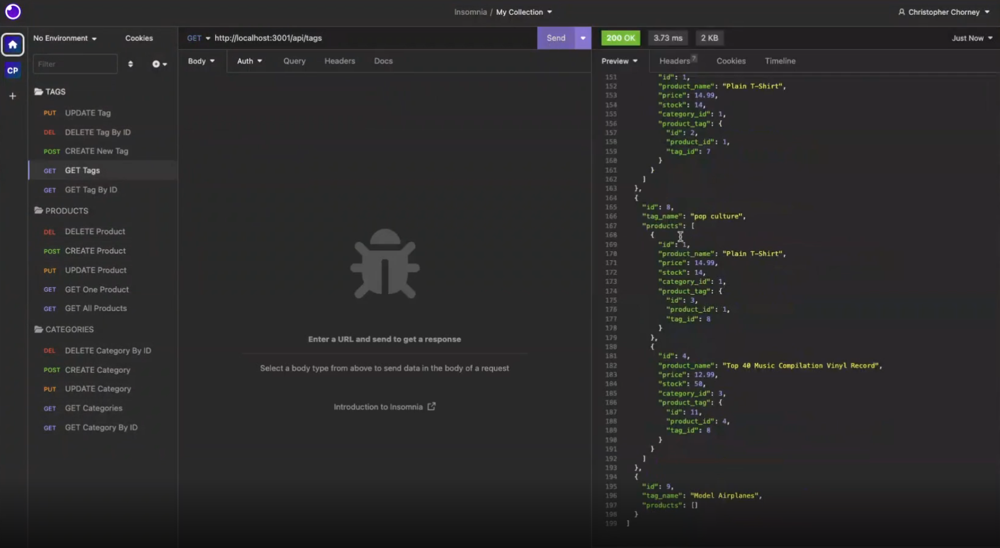

# E-Commerce Site

An E-Commerce Site that interfaces with a retail company's SQL database.

## Description

- This application helps the retail company to manage their inventory by providing api routes that can manage creation, updating, and deleting information related to categories, products and tags.
- Because of the ever-changing nature of inventory pricing, quantities and products, the company needs a fast and secure way of organizing their SQL database so that they can keep track of all inventory changes.
- By allowing the inventory manager to quickly update, add and delete data related to all products in the system, the company can quickly adapt to inventory needs and changes without having to sort through large amounts of data or spreadsheets. Data is updated in real-time and reflected in the actual SQL database on the backend of the server.
- The developer learned about the importance of implementing asynchronous functions in managing the database as well as the proper routing techniques for POST, GET, DELETE and PUT requests.

## Table Of Contents

- [Installation](#installation)

- [Usage](#usage)

- [Credits](#credits)

- [License](#license)

## Installation

- Open the database folder in the terminal and run "mysql"
- Create the database: type "source schema.sql;"
- Close mysql: type "quit"
- Bring in all dependencies: type "npm i"
- Seed the sql database: type "npm run seeds"
- Start the server: type "npm start"

## Usage

- Use a REST route tester like [Insomnia](https://insomnia.rest/) to test all GET, DELETE, PUT and POST routes.

## Screenshot / Video

[Video Demo: The Command Line](https://drive.google.com/file/d/1KLVxEiplHHxDzjNZfcVqFViZcOMzcnUr/view)

[Video Demo: Insomnia Route Testing](https://drive.google.com/file/d/1waaoQxt0aBtQoZknFlLC47nvQXKs_i8W/view)

## Contributing

Third party assets used in this project include:

[Insomnia](https://insomnia.rest/)

## License

This project is licensed under the MIT license.

## Features

Command-line application that serves routes for an e-commerce site backend sql database managment system

## Tests

none

## Questions

Please direct questions to the owner of this repository at ckc2007@gmail.com

Owner GitHub page:
[ckc2007](https://github.com/ckc2007).

## Credits

This README was created using the README generator app by ckc2007!
visit the GitHub page to try it out:
[README Generator app by ckc2007](https://github.com/ckc2007/README-Generator)
